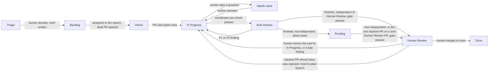

# Workflow

## Artifacts

- **Issue.** States one goal, the approach, and acceptance criteria. Work starts as an issue in Triage. The human decides what to build in a comment on that issue. The title describes the present state, and every issue has a type: Feature, Bug, or Task. See [working-agreements.md](working-agreements.md).
- **Brief.** The owner bot's instructions to one worker for one change: a whole issue, or a named part of one. See [briefs.md](briefs.md).
- **Pull request.** One per worker's change, branched from main and targeting main. It starts as a draft. An issue usually becomes one pull request, but a large issue can be split into several, each with its own worker and branch and each naming the part of the issue it covers. A partial pull request references the issue without a closing keyword, for example `Part of #N`. Only the pull request that completes the issue's acceptance criteria uses a closing keyword such as `Fixes #N`, so merging a partial change doesn't close the issue early. The title completes the sentence "Merging this pull request will ..." and starts with an imperative verb.
- **Board.** One card per issue or pull request. The column says what happens next.
- **Staging branch.** An integration branch that collects changes for testing on the staging environment. It is never merged into main.

## Board columns

| Column | Holds | Who moves the card in |
|---|---|---|
| Inbox | Anything kept out of the flow for now. After launch, new tickets from customers. A sandboxed agent reviews each ticket, reproduces the problem if there is one, and suggests what to do | Anyone |
| Discuss | Issues that need careful thought or a conversation. Set aside so simple triage items flow first | Human |
| Triage | Open issues only. Each has clear suggested plans from an agent (the owner bot), posted as options on the issue. Questions for the human also go on the issue, and the issue stays in Triage. They wait on the human to decide whether or when to do the work, to choose a plan, or to send the issue back for more planning | Coordinator |
| Backlog | Open issues only. Each has an approved plan but is not in the current sprint. Workers can take these lower-priority issues when capacity is available | Human or coordinator |
| Active | Open issues only. Each is assigned to the swarm and has sub-issues or a linked open pull request | Coordinator |
| In Progress | Draft pull requests for active issues. A worker is working on each one now | Coordinator |
| Auto Review | Pull requests marked ready. The worker signed off and the automated, adversarial reviewer is running | Coordinator |
| Needs Input | Draft pull requests where the worker needs more information. The latest comment is a question from the worker or the coordinator that a human must answer, for example a missing decision, configuration, credential, or service. A comment alone does not leave this column. The human moves the card out | Coordinator (in), human (out) |
| Human Review | Finished pull requests that passed the gate and wait on the human to test and merge to main. Exactly two pull requests. One stacked pull request may enter when Human Review holds only one pull request and no independent pull request is ready. See [Just-in-time review](#just-in-time-review) | Coordinator, through the gate |
| Pending | A queue of otherwise ready pull requests, sorted by conflict count. Independents wait here with no rebase. The queue head enters Human Review as soon as a slot opens | Coordinator |
| Done | Pull requests merged to main | Human, or the board on merge |
| Canceled | Closed pull requests that will not be merged. This is an error state: work started that should not have started | Human or coordinator |
| Parked | Draft pull requests with real work that we decided not to merge into main or staging yet. Ideally this column is empty | Human or coordinator |

Moving a card to Auto Review also means marking the pull request ready. Moving it back to In Progress or Needs Input means converting it to a draft.

A human comment on a pull request in Human Review, or on a card in Needs Input, does not move the card. The human may come back later and add more comments. Only an explicit column move by the human starts the next workflow step:

- Human Review to In Progress means the human rejected the change. The coordinator relays the human's comments to the worker, and the loop returns to the fix step.
- Needs Input to In Progress means the human answered the questions. The coordinator relays the answers to the worker, and the worker continues the work.

Automation must react to these column-move events directly. A comment event is not a signal to move the card.

Discuss is a side column, not a step in the loop. It holds issues that need careful thought or a conversation. They are set aside so simple triage items flow first. The coordinator does not launch a worker for a Discuss item, and does not count it as waiting on the human. The human comments on the issue. The agent responds by rewriting the issue body to match those answers. This repeats until the issue is ready for Backlog or Active. Agents do not move the card forward on their own. On a board that also has Inbox and Triage, Discuss sits after Inbox and before Triage.

### Issues and pull requests on the board

Every pull request card must have a Status. Set a new card to In Progress if the pull request is a draft or is still being pushed. Otherwise, set it to Auto Review and request a review. Never leave its Status blank.

Issues and pull requests use different columns. Issues go in Inbox, Discuss, Triage, Backlog and Active. Pull requests go in every column from In Progress to Parked. Do not remove an issue card when a pull request links it: the issue moves to Active and stays there while the pull request is open. When the human merges the pull request, close the issue, take it out of Active, and delete the branch. When the blocker of a Pending pull request merges, the coordinator updates the pull request and moves it on to Human Review through the gate.

When the human approves an issue, the coordinator starts a worker. The worker pushes a first commit on its branch. The coordinator then assigns the issue to the swarm and opens a draft pull request from that branch, with a closing link such as Fixes. Only then does the issue card move to Active, and only then does the worker continue. The issue never sits in Active without that link. A "Part of" mention is not a link.

Active holds only open issues that are assigned to the swarm and have open sub-issues or a linked open pull request. The pull request card keeps moving through In Progress, Auto Review, Pending, and Human Review. Do not move the issue card through those columns, and do not remove it from the board while a linked pull request is open, or while it still has open sub-issues.

When every open pull request that links the issue has merged or closed, and it has no open sub-issues, the issue leaves Active. If a pull request used Fixes (or an equivalent closing phrase) and GitHub closed the issue, the issue card goes to Done. If the issue is still open, it returns to Triage or Needs Input, as fits.

An issue with no pull request and no open sub-issues never goes in Human Review, Pending, or Active. If it is waiting on the human, put a question on it and leave it where it is.


```mermaid
flowchart LR
    T[Triage] -->|human decides, brief written| B[Backlog]
    B -->|assigned to the swarm, draft PR opened| AC[Active]
    AC -.->|PR card starts here| IP[In Progress]
    IP -->|worker asks a question| NI[Needs Input]
    NI -->|human answers| IP
    IP -->|coordinator pre-check passes| AR[Auto Review]
    AR -->|P1 or P2 finding| IP
    AR -->|finished, independent of Human Review, gate passes| HR[Human Review]
    AR -->|finished, not independent, stack-clean| P[Pending]
    P -->|now independent, or the one stacked PR on a lone Human Review PR, gate passes| HR
    HR -->|human moves the card to In Progress, or a late finding| IP
    HR -->|stacked PR whose base was rejected: reset to plain branch| IP
    HR -->|human merges to main| D[Done]
```

The issue card stays in Active while its pull request is open. The pull request card moves through In Progress, Auto Review, Pending, and Human Review.

### Moving cards without losing a step

Entering Auto Review is one action: move the card, mark the pull request ready, request an automated review of the current head, and record the head that was sent for review. A card in Auto Review with no review request or review on its current head is a stall. A change that has reached the round cap doesn't go back to Auto Review. The coordinator verifies the new head itself (step 7) and goes on to its post-check.

When the automation holds off a step because the worker is still busy, it records the deferral, with the pull request, head and time. It rechecks within 15 minutes, and on every periodic scan after that, until the worker is idle or a newer push replaces the deferral. Then it does the deferred step on the current head. The periodic scan also looks at In Progress cards, not only Auto Review. An idle worker whose head is newer than its last review goes through the pre-check and into Auto Review. If the change has reached the round cap, it goes to the coordinator's own verification instead.

A push past the head the coordinator checked sends a Human Review card back to In Progress. The coordinator's post-check names the commit it checked, so a stale pass is easy to spot.

## Triage

New issues and gripes enter Triage. Each issue must include code context for the relevant component, explain why the problem happens, and give two to four numbered fix options with a recommendation. A symptom and expected behavior alone are not enough. The maintainer should be able to choose with one comment.

Work starts as an issue in Triage. The owner bot comments on the issue with options. The human decides in a comment; that comment is the instruction for what to build, and edits to it count too. The coordinator forwards the human's comment to the owner bot.

The owner bot then either:

1. Posts its questions on the issue and leaves the card in Triage, or
2. Writes a brief and moves the card to Backlog. The coordinator launches a coding worker from that brief. The worker branches from main with the pull request base set to main.

Parked items stay parked until the human says otherwise. Product choices belong to the owner bot; the coordinator does not invent them.

## The loop

1. An issue lands in Triage. The owner bot proposes options. The human decides in a comment.
2. The owner bot writes a brief (or first asks questions on the issue in Triage). The coordinator starts a worker. The worker cuts a branch from main, pushes a first commit, and stops.
3. The coordinator opens a draft pull request from that branch against main, with a closing link, assigns the issue to the swarm, and moves the issue card to Active. The pull request card moves to In Progress. The issue never sits in Active without a link. Then the worker pushes code with tests to the pull request.
4. The coordinator runs its pre-review check (see [review.md](review.md)).
5. The coordinator marks the pull request ready, moves the card to Auto Review, and requests an automated review.
6. For each P1 or P2 finding, the coordinator converts the pull request to a draft, moves the card to In Progress, and relays the finding to the worker with the root-cause rule. The worker fixes and pushes. The coordinator verifies the fix, resolves the thread, and returns to step 5.
7. After the round cap, the worker still fixes findings, but the coordinator verifies them itself and requests no more automated reviews.
8. When no P1 or P2 findings remain, the coordinator starts the post-review check, a best-effort staging merge and deploy, and the gate check at once, even if CI on that head is still running. CI can finish in parallel. Do not retake screenshots.
9. Staging deploy is best-effort. The coordinator merges the change into the staging branch and redeploys staging when it can. Do not block Human Review if the body does not name the served commit, or if a served-tree check for dropped lines would fail.
10. For any change a person can see, screenshots or frames go into the pull request description. Existing screenshots count, even from an older head; do not retake them. The description also says where and how to see the change.
11. The coordinator checks the full gate in [review.md](review.md). Only if it passes does the card move to Human Review. The Linux checks on the current head must be green before the card can enter Human Review, even though the other steps started while CI was still running.
12. The human reviews. He merges to main, or he moves the card from Human Review to In Progress to reject the change, which returns it to step 6. A comment in Human Review does not move the card.
13. When a Human Review pull request merges, the coordinator promotes the head of the Pending queue at once, so Human Review holds two again. The reviewer moves on to the other Human Review pull request.
14. While Human Review holds two pull requests and any work is in progress, the coordinator keeps one fully gated ready-next pull request that can enter once both merge. Prefer a pull request that conflicts with nothing. Only when none exists, rebase one pull request onto main plus both Human Review pull requests and gate that tip. If the reviewer rejects a Human Review pull request, rebuild that speculative tip without it.
15. If Human Review becomes empty while work is in progress, the swarm manager tells the reviewer at once, and names the next pull request and its ETA.

When CI completes for a pull request head that is in Auto Review or Pending, a webhook event re-runs the gate in step 11. This is event-driven, not a timer.

### Pull requests that don't target main

The human may approve a change that targets another long-lived branch, such as a deploy-tooling branch. It follows the same loop and skips only the steps that can't apply. For a change that can't go to staging, the gate's deploy conditions are replaced by the check its pull request names, such as the tooling's own test suite, run and recorded on the current head. "Mergeable against main" becomes "mergeable against its base". A skipped step never means the loop stops. After a clean automated review, the coordinator still runs its post-check and the gate, and moves the card to Human Review.

Every pull request card gets a status in the same action that adds it to the board. The periodic scan picks up any open pull request whose card has no status, and any whose latest automated review of the current head is clean but has no coordinator post-check after it.

## Definition of ready

An issue is ready for a worker when:

- The human has decided what to build in a Triage comment (or otherwise approved the issue).
- It states the goal, the approach, and what is out of scope.
- It has acceptance criteria someone can check.
- The human's stated choices are written into it.
- It is not started just to sit behind other work. New In Progress work starts only to refill the Pending buffer.
- It does not depend on unmerged work, or the dependency is named in the issue. If its finished pull request still waits on that work, the pull request card waits in Pending.

## Definition of done

A change is done when:

- The human has merged it to main.
- Its tests ran green on the final head, with pass counts reported.
- Every review finding is fixed at its root cause, with neighboring cases tested.
- It was merged into the staging branch with a best-effort deploy, and the pull request has screenshots or frames if it changed anything a person can see. Existing screenshots count, even from an older head.
- No review threads are open.

## Just-in-time review

Human Review is a buffer for the human's attention. It holds exactly two pull requests (see the two-slot rule in [review.md](review.md#two-slots-and-one-ready-next-pull-request)).

Prefer independent pull requests for the two slots. A pull request is independent when it merges cleanly onto main, it contains no unmerged commits of another Human Review pull request, and it merges cleanly together with each Human Review pull request. The human can merge or reject each independent pull request without an effect on the others.

Pending is a small buffer of finished pull requests that are not independent of Human Review. Each Pending pull request must merge cleanly onto main, onto every Human Review pull request, and onto every Pending pull request ahead of it, in queue order. The pull request body names that stack. When a Pending pull request becomes independent, for example because the pull request it conflicted with merged, it goes to Human Review.

If a finished pull request's plain branch conflicts with the stack, a worker rebases the work onto the stack as <branch>-vN (the next free number; v0 is the unadorned original). The worker pushes that branch only and leaves the original branch and the pull request head untouched. The card stays in In Progress until the vN branch is pushed and is stack-clean, and then it may enter Pending.

Before a pull request enters Human Review with a vN tip as its head, the coordinator installs the tip: it moves the pull request branch to the commit that the worker pushed and tested. This is not new code, so the coordinator or its gate tooling can do it, but only before the card enters Human Review. Never move the branch of a card that is in Human Review. Then the coordinator reruns the tests, the post-check, and the staging merge, redeploy and verification on the new head. Only then does it try to promote the pull request through the gate. Never run the gate on the old head and update the head after, because the old head may conflict with main and a new head voids the checks and staging evidence. A pull request is rejected when the human sends it back or closes it unmerged. Every vN tip built on a rejected pull request is invalid, in Pending and in Human Review, and is never installed, even if the tip later looks independent because the rejected pull request left Human Review. The worker builds a new vN tip without the rejected work. If a pull request was rejected, the coordinator re-checks every remaining Pending pull request against the new stack and requests a new vN branch only when the plain branch no longer applies cleanly. A Pending pull request whose plain branch is still clean keeps that branch.

Pending is a queue sorted by conflict count, with one fully gated ready-next pull request at its head. The In Progress column should stay small (at most three). Start new work only to refill Pending. The buffer runs empty only when there is no remaining work.

### Stacked pull requests

Use a stacked pull request only when Human Review holds exactly one pull request (A) and the next finished pull request (B) depends on A or conflicts with it. Then B can enter Human Review as a stacked pull request, so that the human has two items to review. Rules:

- Human Review holds at most one stacked pull request. A is not itself stacked.
- The rule "A is the only pull request in Human Review" applies when B enters. After B is in Human Review, B stays eligible while A is in Human Review, even when independent pull requests enter next to them.
- B's head is its vN tip, built on A. It contains A's commits and merges cleanly onto main plus A. Before the coordinator installs the tip, it saves B's plain tip as <branch>-v0, so that the plain content stays available.
- B's pull request body starts with this banner, before any other text. Replace A with the number of the base pull request:

  ```
  # STACKED ON #A: MERGE #A INTO MAIN FIRST

  > **This pull request contains the changes of #A.** Merge it only after #A is merged into main.
  > If #A is rejected, do not merge this pull request. The coordinator resets it to its plain branch,
  > without the changes of #A, before it can be merged.
  ```

- Independent pull requests can still enter Human Review next to A and B. Each one must merge cleanly together with A and with B.
- The gate fails a stacked pull request when the banner is missing or is not at the top, when its head contains a Human Review pull request's commits but has no banner, or when its base was closed unmerged or has left Human Review.

If the human merges A, the coordinator checks that B still merges cleanly onto main. If it does, the coordinator removes the banner. No other change is needed. If it does not, for example because A was squash-merged and B still carries A's original commits, the coordinator moves B out of Human Review to In Progress, and asks the worker to rebuild B on the current main without replaying A. Then B goes through the normal loop again.

If the human rejects A (closes it unmerged, or sends it back so that it leaves Human Review), B must never be merged with A's changes. The coordinator acts at once, before the human can merge B:

1. It moves B's card out of Human Review to In Progress. This comes first, so that the branch of a card in Human Review is never moved.
2. It resets B's branch to the saved plain tip (<branch>-v0) and removes the banner. If no plain tip was saved, it asks the worker to rebuild B on main without A's commits.
3. It runs the normal loop again on the new head: tests, review, post-check, staging, screenshots, and the gate. B can then enter Human Review again as an independent pull request.

## Worker liveness

A card in In Progress must have a live worker that is doing the work. A shell window or a saved session is not a live worker.

- When a worker finishes, parks or exits, the same action moves its card. A finished draft goes through the pre-check, is marked ready and moves to Auto Review. A card that waits on a human decision moves to Pending: the coordinator adds the `needs-decision` label and names the open question as the blocker. A card that waits on another change also moves to Pending and names that change. An issue card with no pull request yet goes back to Backlog with the question in a comment.
- A worker that ends its turn with a question about the next step is not finished. The coordinator answers or routes the question in the same scan, and does not leave the card in In Progress.
- A resume that fails is a board event. The coordinator reads the resume result. If no worker started, the coordinator starts one or moves the card out of In Progress.
- Each scan compares In Progress cards with live workers. A card with no live worker, or with an idle worker and no new push, is a stall. The scan fixes it in that run.

## Blocked work

A change that is otherwise ready but waits on another change goes to Pending, not Auto Review or Human Review. Its pull request body names each blocker on its own line in a fixed form such as `Blocked by #N`, so automation can read it. Notes in a worker's session don't count. An issue that no pull request has picked up yet stays in Backlog even when it waits on other work, and it uses the same `Blocked by #N` lines in its body.

Each time a pull request merges, the coordinator's automation looks for Pending cards that list it or the issue it closes. When all of a card's blockers have merged, the coordinator rebases or merges main into the branch, moves the card out of Pending, tells the worker to resume, and continues the loop. When a Backlog issue's blockers have all merged, the coordinator reports that it is unblocked and ready for a worker. The periodic scan treats a Pending card whose blockers have all merged as a stall, not as a wait, and reports any Backlog issue whose blockers have all merged.

A change that waits on a person or on the environment, such as a decision, missing configuration, credentials, or a service that staging lacks, does not go to Pending. Convert the pull request to a draft, move the card to Needs Input, and post a comment that names what is missing and who must provide it. When the answer or the missing item arrives, the loop resumes as described in the gate in [review.md](review.md). A comment on that card does not move it. When the human moves the card to In Progress, the coordinator relays the answers and the work continues.

A block must point one way. Sometimes a change can't show its evidence on its own. For example, it adds code that nothing on screen uses yet, so the screenshot has to come from the follow-up change that uses it. Then the follow-up must not wait for the first change to merge, because the first change can't reach Human Review without that evidence. That is a circular wait, and both changes sit idle. Instead:

- The follow-up starts at once. Its branch is cut from main, with the first change's branch merged into it. Its pull request targets main and names the first change as its blocker.
- The follow-up's staging evidence goes into both pull request descriptions, so the first change can pass the gate.
- On each scan, the coordinator checks that every Pending card's blocker can move forward without that card. If the blocker can't, the coordinator breaks the cycle this way right away.

### Blocked on the staging environment

Sometimes a change is finished and reviewed, but staging itself is broken in a way the worker can't see into. For example, every file write returns a server error while reads and other requests work, and the worker can't read the server's logs. The worker can't take the required screenshots, so the change can't pass the gate.

- The worker stops, cleans up anything it created on staging, and ends its turn with a status line that says it's blocked on staging. The line names the symptom, the request that fails, and what the worker ruled out.
- The coordinator treats that line as a handoff, not as a finished turn. In the same pass, it sends the symptom to whoever operates staging (the operator role, or the human if no one else can read the server logs). The card moves to Pending, and the pull request body names the staging fault as the blocker.
- When the operator says the fault is fixed, the coordinator checks the failing request itself, then tells the worker to finish the screenshots. The card goes back into the loop at step 10.
- A scan that finds a worker blocked on staging, with no message to the operator yet, counts it as a stall.

A broken staging environment also blocks every other change that needs screenshots there. So the coordinator reports it once, names each change that is waiting on it, and resumes all of them when it's fixed.

## Deploy automation target

As of 2026-11-07, the target is to replace Actions SSH redeploy jobs with a signed GitHub push webhook. This is in progress, not a claim that the listener is live.

A small listener on the shared build box verifies `X-Hub-Signature-256` using a secret kept out of git. It accepts pushes to main and work, returns 202 immediately, and queues the existing redeploy targets under the host-wide redeploy lock. It logs each run. Main pushes redeploy production targets after the maintainer merges; work pushes redeploy staging targets. Bots still never merge to main or deploy production themselves.

This removes Actions minutes for redeploy jobs, not for testing. The rollout must document where to read deploy logs and how to redeliver a push, then verify a ping and a redelivered push against the served commit.
